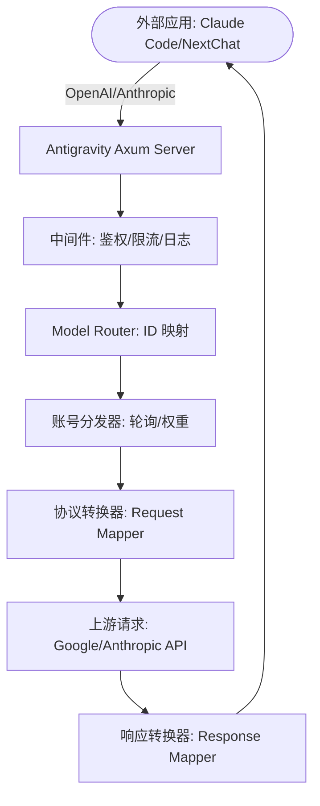

# Antigravity Tools 🚀
> 专业的 AI 账号管理与协议反代系统 (v3.3.10)
<div align="center">
  

  <h3>您的个人高性能 AI 调度网关</h3>
  <p>不仅仅是账号管理，更是打破 API 调用壁垒的终极解决方案。</p>
  
  <p>
    <a href="https://github.com/lbjlaq/Antigravity-Manager">
      
    </a>
    
    
    
    
  </p>

  <p>
    <a href="#-核心功能">核心功能</a> • 
    <a href="#-界面导览">界面导览</a> • 
    <a href="#-技术架构">技术架构</a> • 
    <a href="#-安装指南">安装指南</a> • 
    <a href="#-快速接入">快速接入</a>
  </p>

  <p>
    <strong>简体中文</strong> | 
    <a href="./README_EN.md">English</a>
  </p>
</div>

---

**Antigravity Tools** 是一个专为开发者和 AI 爱好者设计的全功能桌面应用。它将多账号管理、协议转换和智能请求调度完美结合，为您提供一个稳定、极速且成本低廉的 **本地 AI 中转站**。

通过本应用，您可以将常见的 Web 端 Session (Google/Anthropic) 转化为标准化的 API 接口，彻底消除不同厂商间的协议鸿沟。

## 💖 赞助商 (Sponsors)

|  | 感谢 **PackyCode** 对本项目的赞助！PackyCode 是一家可靠高效的 API 中转服务商，提供 Claude Code、Codex、Gemini 等多种服务的中转。PackyCode 为本项目的用户提供了特别优惠：使用[此链接](https://www.packyapi.com/register?aff=Ctrler)注册，并在充值时输入 **“Ctrler”** 优惠码即可享受 **九折优惠**。 |
| :--- | :--- |

## 🌟 深度功能解析 (Detailed Features)

### 1. 🎛️ 智能账号仪表盘 (Smart Dashboard)
*   **全局实时监控**: 一眼洞察所有账号的健康状况，包括 Gemini Pro、Gemini Flash、Claude 以及 Gemini 绘图的 **平均剩余配额**。
*   **最佳账号推荐 (Smart Recommendation)**: 系统会根据当前所有账号的配额冗余度，实时算法筛选并推荐“最佳账号”，支持 **一键切换**。
*   **活跃账号快照**: 直观显示当前活跃账号的具体配额百分比及最后同步时间。

### 2. 🔐 强大的账号管家 (Account Management)
*   **OAuth 2.0 授权（自动/手动）**: 添加账号时会提前生成可复制的授权链接，支持在任意浏览器完成授权；回调成功后应用会自动完成并保存（必要时可点击“我已授权，继续”手动收尾）。
*   **多维度导入**: 支持单条 Token 录入、JSON 批量导入（如来自其他工具的备份），以及从 V1 旧版本数据库自动热迁移。
*   **网关级视图**: 支持“列表”与“网格”双视图切换。提供 403 封禁检测，自动标注并跳过权限异常的账号。

### 3. 🔌 协议转换与中继 (API Proxy)
*   **全协议适配 (Multi-Sink)**:
    *   **OpenAI 格式**: 提供 `/v1/chat/completions` 端点，兼容 99% 的现有 AI 应用。
    *   **Anthropic 格式**: 提供原生 `/v1/messages` 接口，支持 **Claude Code CLI** 的全功能（如思思维链、系统提示词）。
    *   **Gemini 格式**: 支持 Google 官方 SDK 直接调用。
*   **智能状态自愈**: 当请求遇到 `429 (Too Many Requests)` 或 `401 (Expire)` 时，后端会毫秒级触发 **自动重试与静默轮换**，确保业务不中断。

### 4. 🔀 模型路由中心 (Model Router)
*   **系列化映射**: 您可以将复杂的原始模型 ID 归类到“规格家族”（如将所有 GPT-4 请求统一路由到 `gemini-3-pro-high`）。
*   **专家级重定向**: 支持自定义正则表达式级模型映射，精准控制每一个请求的落地模型。
*   **智能分级路由 (Tiered Routing)**: [新] 系统根据账号类型（Ultra/Pro/Free）和配额重置频率自动优先级排序，优先消耗高速重置账号，确保高频调用下的服务稳定性。
*   **后台任务静默降级**: [新] 自动识别 Claude CLI 等工具生成的后台请求（如标题生成），智能重定向至 Flash 模型，保护高级模型配额不被浪费。

### 5. 🎨 多模态与 Imagen 3 支持
*   **高级画质控制**: 支持通过 OpenAI `size` (如 `1024x1024`, `16:9`) 参数自动映射到 Imagen 3 的相应规格。
*   **超强 Body 支持**: 后端支持高达 **100MB** 的 Payload，处理 4K 高清图识别绰绰有余。

## 📸 界面导览 (GUI Overview)


### 💡 使用案例 (Usage Examples)


## 🏗️ 技术架构 (Architecture)



##  安装指南 (Installation)

### 选项 A: macOS 终端安装 (推荐)
如果您已安装 [Homebrew](https://brew.sh/)，可以通过以下命令快速安装：

```bash
# 1. 订阅本仓库的 Tap
brew tap lbjlaq/antigravity-manager https://github.com/lbjlaq/Antigravity-Manager

# 2. 安装应用
brew install --cask antigravity-tools
```
# 如果遇到权限问题，建议使用 --no-quarantine
brew install --cask --no-quarantine antigravity-tools
```

### 选项 B: 手动下载
前往 [GitHub Releases](https://github.com/lbjlaq/Antigravity-Manager/releases) 下载对应系统的包：
*   **macOS**: `.dmg` (支持 Apple Silicon & Intel)
*   **Windows**: `.msi` 或 便携版 `.zip`
*   **Linux**: `.deb` 或 `AppImage`

### 🛠️ 常见问题排查 (Troubleshooting)

#### macOS 提示“应用已损坏，无法打开”？
由于 macOS 的安全机制，非 App Store 下载的应用可能会触发此提示。您可以按照以下步骤快速修复：

1.  **命令行修复** (推荐):
    打开终端，执行以下命令：
    ```bash
    sudo xattr -rd com.apple.quarantine "/Applications/Antigravity Tools.app"
    ```
2.  **Homebrew 安装技巧**:
    如果您使用 brew 安装，可以添加 `--no-quarantine` 参数来规避此问题：
    ```bash
    brew install --cask --no-quarantine antigravity-tools
    ```

## 🔌 快速接入示例

### 🔐 OAuth 授权流程（添加账号）
1. 打开“Accounts / 账号” → “添加账号” → “OAuth”。
2. 弹窗会在点击按钮前预生成授权链接；点击链接即可复制到系统剪贴板，然后用你希望的浏览器打开并完成授权。
3. 授权完成后浏览器会打开本地回调页并显示“✅ 授权成功!”。
4. 应用会自动继续完成授权并保存账号；如未自动完成，可点击“我已授权，继续”手动完成。

> 提示：授权链接包含一次性回调端口，请始终使用弹窗里生成的最新链接；如果授权时应用未运行或弹窗已关闭，浏览器可能会提示 `localhost refused connection`。

### 如何接入 Claude Code CLI?
1.  启动 Antigravity，并在“API 反代”页面开启服务。
2.  在终端执行：
```bash
export ANTHROPIC_API_KEY="sk-antigravity"
export ANTHROPIC_BASE_URL="http://127.0.0.1:8045"
claude
```

### 如何接入 Kilo Code?
1.  **协议选择**: 建议优先使用 **Gemini 协议**。
2.  **Base URL**: 填写 `http://127.0.0.1:8045`。
3.  **注意**: 
    - **OpenAI 协议限制**: Kilo Code 在使用 OpenAI 模式时，其请求路径会叠加产生 `/v1/chat/completions/responses` 这种非标准路径，导致 Antigravity 返回 404。因此请务必填入 Base URL 后选择 Gemini 模式。
    - **模型映射**: Kilo Code 中的模型名称可能与 Antigravity 默认设置不一致，如遇到无法连接，请在“模型映射”页面设置自定义映射，并查看**日志文件**进行调试。

### 如何在 Python 中使用?
```python
import openai

client = openai.OpenAI(
    api_key="sk-antigravity",
    base_url="http://127.0.0.1:8045/v1"
)

response = client.chat.completions.create(
    model="gemini-3-flash",
    messages=[{"role": "user", "content": "你好，请自我介绍"}]
)
print(response.choices[0].message.content)
```

## 📝 开发者与社区

*   **版本演进 (Changelog)**:
    *   **v3.3.10 (2026-01-01)**:
        - 🌐 **上游端点 Fallback 机制** (核心致谢 @karasungur PR #243):
            - **多端点自动切换**: 实现 `prod → daily` 双端点 Fallback 策略，当主端点返回 404/429/5xx 时自动切换到备用端点，显著提升服务可用性。
            - **连接池优化**: 新增 `pool_max_idle_per_host(16)`、`tcp_keepalive(60s)` 等参数，优化连接复用，减少建立开销，特别适配 WSL/Windows 环境。
            - **智能重试逻辑**: 支持 408 Request Timeout、404 Not Found、429 Too Many Requests 和 5xx Server Error 的自动端点切换。
            - **详细日志记录**: Fallback 成功时记录 INFO 日志，失败时记录 WARN 日志，便于运维监控和问题排查。
            - **与调度模式完全兼容**: 端点 Fallback 与账号调度（缓存优先/平衡/性能优先）工作在不同层级，互不干扰，确保缓存命中率不受影响。
        - 📝 **日志系统全面优化**:
            - **日志级别重构**: 严格区分 INFO/DEBUG/TRACE 级别，INFO 仅显示关键业务信息，详细调试信息降级到 DEBUG。
            - **心跳请求过滤**: 将 `/api/event_logging/batch` 和 `/healthz` 等心跳请求从 INFO 降级到 TRACE，彻底消除日志噪音。
            - **账号信息显示**: 在请求开始和完成时显示使用的账号邮箱，便于监控账号使用情况和调试会话粘性。
            - **流式响应完成标记**: 为流式响应添加完成日志（包含 Token 统计），确保请求生命周期可追踪。
            - **日志量减少 90%+**: 正常请求从 50+ 行降至 3-5 行，启动日志从 30+ 行降至 6 行，大幅提升可读性。
            - **Debug 模式**: 通过 `RUST_LOG=debug` 可查看完整请求/响应 JSON，支持深度调试。
        - 🎨 **Imagen 3 图像生成增强**:
            - **新增分辨率支持**: 支持通过模型名后缀指定 `-2k` 分辨率，满足更高清的绘图需求。
            - **超宽比例支持**: 新增 `-21x9` (或 `-21-9`) 比例支持，适配带鱼屏显示。
            - **映射优化**: 优化了分辨率与比例的自动映射逻辑，支持 `2560x1080` 等自定义尺寸。
            - **全协议覆盖**: 该增强功能已同步覆盖 OpenAI、Claude 及 Gemini 原生协议。
        - 🔍 **模型检测 API**:
            - **新增探测接口**: 提供 `POST /v1/models/detect` 接口，支持实时探测特定模型的图片生成能力及配置组合。
            - **动态模型列表**: `/v1/models` 接口现在自动罗列所有分辨率与比例的画图模型变体（如 `gemini-3-pro-image-4k-21x9`），方便客户端调用。
        - 🐛 **后台任务降级模型修复**:
            - **修复 404 错误**: 将后台任务降级模型从不存在的 `gemini-2.0-flash-exp` 修正为 `gemini-2.5-flash-lite`，解决标题生成、摘要等后台任务的 404 错误。
        - 🔐 **账号主动禁用功能**:
            - **独立禁用控制**: 新增账号主动禁用功能,区别于 403 禁用,仅影响反代池,不参与 API 请求。
            - **应用内可用**: 主动禁用的账号仍可在应用中切换使用、查看配额详情,仅从反代池中移除。
            - **视觉区分**: 403 禁用显示红色"已禁用"徽章,主动禁用显示橙色"反代已禁用"徽章。
            - **批量操作**: 支持批量禁用/启用多个账号,提高管理效率。
            - **自动重载**: 禁用/启用操作后自动重新加载反代账号池,立即生效。
            - **影响范围**: 标题生成、简单摘要、系统消息、提示建议、环境探测等轻量任务现在正确降级到 `gemini-2.5-flash-lite`。
        - 🎨 **UI 体验提升**:
            - **反代页弹窗风格统一**: 将 ApiProxy 页面中所有原生的 alert/confirm 弹窗统一为应用标准的 Toast 通知与 ModalDialog 对话框，提升视觉一致性。
            - **Tooltip 遮挡修复**: 修复了反代设置页面中（如"调度模式"、"允许局域网访问"等）Tooltip 被左侧容器遮挡的问题，优化阅读体验。
    *   **v3.3.9 (2026-01-01)**:
        - 🚀 **全协议调度对齐**: `Scheduling Mode` 现在正式覆盖 OpenAI (Cursor/Cherry)、Gemini 原生及 Claude 协议。
        - 🧠 **工业级 Session 指纹**: 升级 SHA256 内容哈希算法生成粘性 Session ID，确保 CLI 重启后仍能完美继承同一账号，极大提升 Prompt Caching 命中率。
        - 🛡️ **精准限流与 5xx 故障避让**: 深度集成 Google API JSON 报文解析，支持毫秒级 `quotaResetDelay` 提取，并在 500/503/529 故障时自动触发 20s 避让隔离，实现平滑热切换。
        - 🔀 **智能调度算法升级**: `TokenManager` 轮转时主动避开所有限流或隔离账号；全量限流时精准提示最短重置时间。
        - 🌐 **全局限流同步**: 引入跨协议限流追踪器，任意协议触发限流均会实时同步至全局账号池，实现“一端限流，全局避让”。
        - 📄 **Claude 多模态补全**: 修复 Claude CLI 传输 PDF 等文档时的 400 错误，补全多模态映射逻辑。
    *   **v3.3.8 (2025-12-31)**:
        - **代理监控模块 (核心致谢 @84hero PR #212)**:
            - **实时请求追踪**: 全新的监控仪表板，实时可视化查看所有反代流量，包括请求路径、状态码、响应时间、Token消耗等详细信息。
            - **持久化日志存储**: 基于 SQLite 的日志系统，支持跨应用重启的历史记录查询与分析。
            - **高级筛选与排序**: 支持实时搜索、按时间戳排序，快速定位问题请求。
            - **详细检视模态框**: 点击任意请求即可查看完整的请求/响应 Payload、Header、Token 计数等调试信息。
            - **性能优化**: 紧凑的数据格式化（如 1.2k 代替 1200）提升大数据量下的 UI 响应速度。
        - **UI 优化与布局改进**:
            - **Toggle 样式统一**: 将所有Toggle开关（自动启动、局域网访问、访问授权、外部提供商）统一为小号蓝色样式，整体视觉更一致。
            - **布局密度优化**: 将"允许局域网访问"和"访问授权"合并为单行网格布局（lg:grid-cols-2），在大屏幕上更高效利用空间。
        - **Zai Dispatcher 调度器集成 (核心致谢 @XinXin622 PR #205)**:
            - **多级分发模式**: 支持 `Exclusive` (专属)、`Pooled` (池化) 和 `Fallback` (回退) 三种调度模式，灵活平衡响应速度与账号安全性。
            - **内置 MCP 服务支持**: 预置 Web Search Prime、Web Reader 和 Vision 等 MCP 接口地址，支持本地/局域网直接调用。
            - **配置界面升级**: 在 ApiProxy 页面增加了配套的图形化配置项与交互提示。
        - **账号异常自动处理 (核心致谢 @salacoste PR #203)**:

            - **自动禁用失效账号**: 当 Google OAuth 刷新令牌失效（触发 `invalid_grant` 错误）时，系统会自动将该账号标记为禁用状态，防止代理服务因重复尝试故障账号而产生 5xx 错误。
            - **持久化状态管理**: 账号的禁用状态会自动保存到磁盘，系统重启后仍可保持。同时优化了加载逻辑，跳过所有已禁用的账号。
            - **智能自动恢复**: 用户在 UI 界面手动更新账号令牌后，系统会自动重新启用该账号。
            - **文档完善**: 添加了针对 `invalid_grant` 异常处理机制的详细说明文档。
        - **动态模型列表 API (智能化端点优化)**:
            - **实时动态同步**: `/v1/models` (OpenAI) 和 `/v1/models/claude` (Claude) 接口现在实时聚合内置映射与用户自定义映射，修改设置即刻生效。
            - **全量模型支持**: 接口不再强制过滤前缀，支持直接在终端或客户端查看并使用 `gemini-3-pro-image-4k-16x9` 等画图模型及所有自定义 ID。
        - **账号配额管理与模型分级路由 (运营优化与 Bug 修复)**:
            - **后台任务智能降级**: 自动识别并重放 Claude CLI/Agent 的后台任务（标题、摘要等）为 Flash 模型，解决之前该类请求错误消耗长文本/高级模型额度的问题。
            - **并发锁与额度保护**: 修复了高并发场景下多个请求同时导致账号额度超限的问题。通过原子锁（Atomic Lock）确保同一会话内的请求一致性，避免不必要的账号轮换。
            - **账号分级排序 (ULTRA > PRO > FREE)**: 系统现在根据账号配额重置频率（每小时 vs 每日）自动排序模型路由。优先消耗更频繁重置的高级账号，将 FREE 账号作为最后的冗余保障。
            - **原子化并发锁定**: 优化了 TokenManager 的会话锁定逻辑。在高并发并发（如 Agent 模式）下，确保同一会话的请求能稳定锁定在同一账号，彻底解决轮询暴走问题。
            - **关键词库扩展**: 内置 30+ 种高频后台指令特征库，覆盖 5 大类主流 Agent 后台操作，识别率提升至 95% 以上。

    *   **v3.3.7 (2025-12-30)**:
        - **Proxy 核心稳定性修复 (核心致谢 @llsenyue PR #191)**:
            - **JSON Schema 深度硬化**: 实现了对工具调用 Schema 的递归平坦化与清理，自动将 Gemini 不支持的校验约束（如 `pattern`）迁移至描述字段，彻底解决 Schema 拒绝问题。
            - **后台任务鲁棒性增强**: 新增后台任务（如摘要生成）检测，自动过滤思维链配置与历史块，并定向转发至 `gemini-2.5-flash` 以确保 100% 成功率。
            - **思维链签名自动捕获**: 优化了 `thoughtSignature` 的提取与持久化逻辑，解决了多轮对话中因签名丢失导致的 `400` 错误。
            - **日志体验优化**: 提升了用户消息的日志优先级，确保核心对话信息不被后台任务日志淹没。
    *   **v3.3.6 (2025-12-30)**:
        - **OpenAI 图像功能深度适配 (核心致谢 @llsenyue PR #186)**:
            - **新增图像生成接口**: 完整支持 `/v1/images/generations` 端点，支持 `model`、`prompt`、`n`、`size` 及 `response_format` 等标准参数。
            - **新增图像编辑与变换接口**: 适配 `/v1/images/edits` 和 `/v1/images/variations` 端点。
            - **底层协议桥接**: 实现了 OpenAI 图像请求到 Google Internal API (Cloud Code) 的自动结构化映射与身份验证。
    *   **v3.3.5 (2025-12-29)**:
        - **核心修复与稳定性增强**:
            - **彻底修复 Claude Extended Thinking 400 错误 (模型切换场景)**: 解决了在同一会话中从普通模型切换到思维链模型时，因历史消息缺少思维块导致的 Google API 校验失败。现在只要开启 Thinking 模式，系统会自动为合规性补全历史思维块。
            - **新增 429 错误自动账号轮转 (Account Rotation)**: 优化了重试机制。当请求遇到 `429` (限流/配额)、`403` (权限) 或 `401` (认证失效) 错误时，系统在重试时会 **强制绕过 60s 会话锁定** 并切换到账号池中的下一个可用账号，并实现故障迁移。
            - **单元测试维护**: 修复了代码库中多个陈旧且破损的单元测试，确保了开发环境的编译与逻辑校验闭环。
        - **日志系统优化**:
            - **清理冗余日志**: 移除了配额查询时逐行打印所有模型名称的冗余日志，将详细模型列表信息降级为 debug 级别，显著减少控制台噪音。
            - **本地时区支持**: 日志时间戳现已自动使用本地时区格式（如 `2025-12-29T22:50:41+08:00`），而非 UTC 时间，便于用户直观查看。
        - **UI 优化**:
            - **优化账号额度刷新时间显示**: 增加时钟图标、实现居中对齐与动态颜色反馈（表格与卡片视图同步优化）。
    *   **v3.3.4 (2025-12-29)**:
        - **OpenAI/Codex 兼容性大幅增强 (核心致谢 @llsenyue PR #158)**:
            - **修复图像识别**: 完美适配 Codex CLI 的 `input_image` 块解析，并支持 `file://` 本地路径自动转 Base64 上传。
            - **Gemini 400 错误治理**: 实现了连续相同角色消息的自动合并，严格遵循 Gemini 角色交替规范，彻底解决此类 400 报错。
            - **协议稳定性增强**: 优化了 JSON Schema 深度清理（新增对 `cache_control` 的物理隔离）及 `thoughtSignature` 的上下文回填逻辑。
            - **Linux 构建策略调整**: 由于 GitHub 的 Ubuntu 20.04 运行器资源极度匮乏导致发布挂起，官方版本现回归使用 **Ubuntu 22.04** 环境编译。Ubuntu 20.04 用户建议自行克隆源码完成本地构建，或使用 AppImage 尝试运行。
    *   **v3.3.3 (2025-12-29)**:
        - **账号管理增强**:
            - **订阅等级智能识别**: 新增对账号订阅等级（PRO/ULTRA/FREE）的自动识别、标识与筛选支持。
            - **多维筛选系统**: 账号管理页引入“全部/可用/低配额/PRO/ULTRA/FREE”多维度筛选 Tab，支持实时计数与联动搜索。
            - **UI/UX 深度优化**: 采用高感度 Tab 切换设计；重构顶部工具栏布局，引入弹性搜索框与响应式操作按钮，显著提升各分辨率下的空间利用率。
        - **核心修复**:
            - **彻底修复 Claude Extended Thinking 400 错误**: 解决了历史 `ContentBlock::Thinking` 消息中缺失 `thought: true` 标记导致的格式校验错误。此修复解决了 95% 以上的 Claude 思维链相关报错，大幅提升多轮对话稳定性。此问题会导致不管是否显式开启 thinking 功能，在多轮对话（特别是使用 MCP 工具调用）时都会出现 `400 INVALID_REQUEST_ERROR`。修复后，所有 thinking blocks 都会被正确标记，上游 API 能够准确识别并处理。
            - **影响范围**: 此修复解决了 95%+ 的 Claude Extended Thinking 相关 400 错误，大幅提升了 Claude CLI、MCP 工具集成等场景下的多轮对话稳定性。
    *   **v3.3.2 (2025-12-29)**:
        - **新增功能 (核心致谢 @XinXin622 PR #128)**:
            - **Claude 协议联网搜索引用支持**: 实现了将 Gemini 的 Google Search 原始识别结果映射为 Claude 原生的 `web_search_tool_result` 内容块。现在支持在 Cherry Studio 等兼容客户端中直接显示结构化的搜索引文及来源链接。
            - **Thinking 模式稳定性增强 (Global Signature Store v2)**: 引入了更强大的全局 `thoughtSignature` 存储机制。系统能够实时捕获流式响应中的最新签名，并自动为缺少签名的后续请求（特别是在会话恢复场景下）进行回填，显著减少了 `400 INVALID_ARGUMENT` 报错。
        - **优化与修复 (Optimizations & Bug Fixes)**:
            - **数据模型鲁棒性增强**: 统一并重构了内部的 `GroundingMetadata` 数据结构，解决了 PR #128 集成过程中发现的类型冲突与解析异常。
            - **流式输出逻辑优化**: 优化了 SSE 转换引擎，确保 `thoughtSignature` 在跨多个 SSE 块时能被正确提取与存储。
    *   **v3.3.1 (2025-12-28)**:
        - **重大修复 (Critical Fixes)**:
            - **Claude 协议 400 错误深度修复 (Claude Code 体验优化)**:
                - **解决缓存控制冲突 (cache_control Fix)**: 彻底解决了在长上下文对话中，由于历史消息中包含 `cache_control` 标记或 `thought: true` 字段引发的上游校验报错。通过"历史消息去思考化"策略，完美绕过了 Google API 兼容层的解析 Bug，确保了长会话的稳定性。
                - **深度 JSON Schema 清理引擎**: 优化了 MCP 工具定义的转换逻辑。现在会自动将 Google 不支持的复杂校验约束（如 `pattern`、`minLength`、`maximum` 等）迁移到描述字段中，既符合上游 Schema 规范，又保留了模型的语义提示。
                - **协议头合规化**: 移除了系统指令中非标准的 `role`标记，并增强了对 `cache_control` 的显式过滤与拦截，确保生成的 Payload 达到最佳兼容性。
            - **全协议内置联网工具适配**: 针对用户反馈，现在 **OpenAI、Gemini 和 Claude 协议** 均支持“无需模型后缀”即可触发联网。
                - **联网探测兼容性增强**: 支持 `googleSearchRetrieval` 等新一代工具定义，并提供统一的 `googleSearch` 载荷标准化映射，确保 Cherry Studio 等客户端的联网开关能完美触发。
                - **客户端脏数据自动净化**: 新增深度递归清洗逻辑，物理移除 Cherry Studio 等客户端在请求中注入的 `[undefined]` 无效属性，从根源解决 `400 INVALID_ARGUMENT` 报错。
                - **高品质虚拟模型自动联网**: 进一步扩容高性能模型白名单（补全了 Claude 系列 Thinking 变体等），确保所有顶级模型均能享受原生的联网搜索回显体验。
        - **核心优化与省流增强 (Optimization & Token Saving)**:
            - **全链路追踪与闭环审计日志**:
                - 为每个请求引入 6 位随机 **Trace ID**。
                - 自动标记请求属性：`[USER]` 为真实对话，`[AUTO]` 为后台任务。
                - 实现了流式/非流式响应的 **Token 消耗闭环回显**。
            - **Claude CLI 后台任务智能“截胡” (Token Saver)**:
                - **精准意图识别**: 新增对标题生成、摘要提取以及系统 Warmup/Reminder 等后台低价值请求的深度识别。
                - **无感降级转发**: 自动将后台流量重定向至 **gemini-2.5-flash**，确保顶配模型（Sonnet/Opus）的额度仅用于核心对话。
                - **显著节流**: 单次长会话预计可省下 1.7k - 17k+ 的高价值 Token。
        - **稳定性增强**: 
            - 修复了由于模型字段定义更新导致的 Rust 编译与测试用例报错，加固了数据模型层（models.rs）的鲁棒性。
    *   **v3.3.0 (2025-12-27)**:
        - **重大更新 (Major Updates)**:
            - **Codex CLI & Claude CLI 深度适配 (核心致谢 @llsenyue PR #93)**: 
                - **全面兼容 Coding Agent**: 实现了对 Codex CLI 的完美支持，包括 `/v1/responses` 端点的深度适配与 shell 工具调用指令的智能转换 (SSOP)。
                - **Claude CLI 推理增强**: 引入了全局 `thoughtSignature` 存储与回填逻辑，彻底解决了 Claude CLI 使用 Gemini 3 系列模型时的签名校验报错。
            - **OpenAI 协议栈重构**:
                - **新增 Completions 接口**: 完整支持 `/v1/completions` 和 `/v1/responses` 路由，兼容更多传统 OpenAI 客户端。
                - **多模态与 Schema 清洗融合**: 成功整合了自研的高性能图片解析逻辑与社区贡献的高精度 JSON Schema 过滤策略。
            - **隐私优先的网络绑定控制 (核心致谢 @kiookp PR #91)**:
                - **默认本地回环**: 反代服务器默认监听 `127.0.0.1`，仅允许本机访问，保障隐私安全。
                - **可选 LAN 访问**: 新增 `allow_lan_access` 配置开关，开启后监听 `0.0.0.0` 以允许局域网设备访问。
                - **安全提示**: 前端 UI 提供明确的安全警告及状态提示。
        - **前端体验升级**: 
            - **多协议端点可视化**: 在 API 反代页面新增端点详情展示，支持对 Chat/Completions/Responses 不同端点的独立快捷复制。
    *   **v3.2.8 (2025-12-26)**:
        - **Bug 修复 (Bug Fixes)**:
            - **OpenAI 协议多模态与图片模型支持**: 彻底修复了在 OpenAI 协议下向视觉模型(如 `gemini-3-pro-image`)发送图片请求时因 `content` 格式不匹配导致的 400 错误。
            - **视觉能力全面补齐**: 现在 OpenAI 协议支持自动解析 Base64 图片并映射为上游 `inlineData`,使其具备与 Claude 协议同等的图像处理能力。
    *   **v3.2.7 (2025-12-26)**:
        - **新功能 (New Features)**:
            - **开机自动启动**: 新增开机自动启动功能,可在设置页面的"通用"标签中一键开启/关闭系统启动时自动运行 Antigravity Tools。
            - **账号列表分页大小选择器**: 在账号管理页面的分页栏中新增分页大小选择器,支持直接选择每页显示数量(10/20/50/100 条),无需进入设置页面,提升批量操作效率。
        - **Bug 修复 (Bug Fixes)**:
            - **JSON Schema 清理逻辑全面增强 (MCP 工具兼容性修复)**:
                - **移除高级 Schema 字段**: 新增移除 `propertyNames`, `const`, `anyOf`, `oneOf`, `allOf`, `if/then/else`, `not` 等 MCP 工具常用但 Gemini 不支持的高级 JSON Schema 字段，彻底解决 Claude Code v2.0.76+ 使用 MCP 工具时的 400 错误。
                - **优化递归清理顺序**: 调整为先递归清理子节点再处理父节点，避免嵌套对象被错误序列化到 description 中。
                - **Protobuf 类型兼容**: 强制将联合类型数组（如 `["string", "null"]`）降级为单一类型，解决 "Proto field is not repeating" 错误。
                - **智能字段识别**: 增强类型检查逻辑，确保只在值为对应类型时才移除校验字段，避免误删名为 `pattern` 等的属性定义。
            - **自定义数据库导入修复**: 修复了"从自定义 DB 导入"功能因 `import_custom_db` 命令未注册导致的 "Command not found" 错误。现在用户可以正常选择自定义路径的 `state.vscdb` 文件进行账号导入。
            - **反代稳定性与画图性能优化**:
                - **智能 429 退避机制**: 深度集成 `RetryInfo` 解析，精准遵循 Google API 的重试指令并增加安全冗余，有效降低账号被封禁风险。
                - **精准错误分流**: 修正了将频率限制误判为配额耗尽的逻辑（不再误杀包含 "check quota" 的报错），确保限流时能自动切换账号。
                - **画图请求并发加速**: 针对 `image_gen` 类型请求禁用 60s 时间窗口锁定，实现多账号极速轮换，彻底解决画图 429 报错问题。
    *   **v3.2.6 (2025-12-26)**:
        - **重大修复 (Critical Fixes)**:
            - **Claude 协议深度优化 (Claude Code 体验增强)**:
                - **动态身份映射**: 根据请求模型动态注入身份防护补丁，锁定 Anthropic 原生身份，屏蔽底层中转平台的指令干扰。
                - **工具空输出补偿**: 针对 `mkdir` 等静默命令，自动将空输出映射为显式成功信号，解决 Claude CLI 任务流中断与幻觉问题。
                - **全局停止序列配置**: 针对反代链路优化了 `stopSequences`，精准切断流式输出，彻底解决响应尾部冗余导致的解析报错。
                - **智能 Payload 净化 (Smart Panic Fix)**: 引入了 `GoogleSearch` 与 `FunctionCall` 的互斥检查，并在后台任务（Token Saver）重定向时自动剥离工具负载，彻底根除了 **400 工具冲突 (Multiple tools)** 错误。
                - **反代稳定性增强 (核心致谢 @salacoste PR #79)**: 
                    - **429 智能退避**: 支持解析上游 `RetryInfo`，在触发限流时自动等待并重试，显著减少账号无效轮换。
                    - **Resume 兜底机制**: 针对 `/resume` 可能出现的签名失效报错，实现了自动剥离 Thinking 块的二次重试，提升会话恢复成功率。
                    - **Schema 模式增强**: 增强了 JSON Schema 递归清理逻辑，并增加了对 `enumCaseInsensitive` 等扩展字段的过滤。
            - **测试套件加固**: 修复了 `mappers` 测试模块中缺失的导入及重复属性错误，并新增了内容块合并与空输出补全测试。
    *   **v3.2.3 (2025-12-25)**:
        - **核心增强 (Core Enhancements)**:
            - **进程管理架构优化 (核心致谢 @Gaq152 PR #70)**: 
                - **精确路径识别**: 引入了基于可执行文件绝对路径的进程匹配机制。在启动、关闭及枚举 PID 时，系统会通过规范化路径 (`canonicalize`) 进行比对。
                - **管理进程自排除**: 在 Linux 等环境下，系统现能通过对比 `std::env::current_exe()` 路径，彻底杜绝了 Antigravity-Manager 将自身误识别为核心进程而发生的“自杀”现象。
                - **手动路径自定义**: 在“设置 -> 高级”页面新增了手动指定反重力程序路径的功能。支持 MacOS (.app 目录) 和各平台可执行文件。
                - **自动探测回退**: 新增路径自动探测按钮，并建立了“手动路径优先 -> 自动搜索 -> 注册表/标准目录”的多级检索链。
        - **体验优化 (UX Improvements)**:
            - **路径配置 UI**: 提供了文件选择器与一键重置功能，极大地提升了在非标准目录下部署的灵活性。
            - **多语言适配**: 完整同步了路径管理相关的中英文 I18n 资源。
    *   **v3.2.2 (2025-12-25)**:
        - **核心更新 (Core Updates)**:
            - **全量日志持久化系统升级**: 接入 `tracing-appender` 与 `tracing-log`，实现了终端与文件的双通道日志记录。现在包括系统启动、反代请求全链路（请求/响应/耗时）以及第三方库底层流水在内的所有调试信息，均会实时、自动地归档至本地 `app.log` 中。
            - **Project ID 获取逻辑容错增强**: 引入了随机 `project_id` 兜底机制。针对部分无 Google Cloud 项目权限的账号，系统现在会自动生成随机 ID 以确保反代服务及配额查询能正常运行，彻底解决了“账号无资格获取 cloudaicompanionProject”导致的报错中断。
            - **全场景稳定性加固**: 引入 `try_init` 模式修复了由于日志订阅器重复初始化导致的系统 Panic 崩溃，显著提升了在不同运行环境下的兼容性。
            - **平滑日志清理**: 优化了日志清理逻辑，采用“原地截断”技术。现在点击“清理日志”后，后续的操作记录依然能无缝地继续保存，解决了旧版本清理后记录失效的问题。
            - **Google 免费额度智能路由 (Token Saver):** 
                - **后台任务拦截**: 独家首创针对 Claude Code 客户端后台任务的深度报文识别技术。系统能精准识别标题生成、摘要提取以及 **Next Prompt Suggestions** 等非核心交互请求 (`write a 5-10 word title`, `Concise summary`, `prompt suggestion generator`)。
                - **无感熔断重定向**: 自动将上述高频低价值请求（Haiku 模型）路由至 **gemini-2.5-flash** 免费节点，彻底杜绝了后台轮询对核心付费/高价值账号配额的隐形消耗，同时保留了完整的产品功能体验。
                - **双轨日志审计**: 终端与日志文件中新增请求类型标记。正常对话请求显示为 `检测到正常用户请求`（保留原映射），后台任务显示为 `检测到后台自动任务`（重定向），消耗去向一目了然。
            - **时间窗口会话锁定 (Session Sticky):** 实施了基于滑动时间窗口（60秒）的账号锁定策略。确保单一会话内的连续交互强制绑定同一账号，有效解决了因多账号轮询导致的上下文漂移问题，大幅提升了长对话的连贯性。
        - **Bug 修复 (Bug Fixes)**:
            - **Claude 思维链签名 (Signature) 校验最终修复**: 彻底解决了在多轮对话中，由于历史 Assistant 消息缺少 `thoughtSignature` 而导致的 `400 INVALID_ARGUMENT` 错误。
            - **Gemini 模型映射误匹配修复**: 修正了模型路由关键词匹配逻辑，解决了 `gemini` 单词中包含 `mini` 从而被误判定为 OpenAI 分组的问题。现在 Gemini 模型能正确实现原名穿透。
            - **注入策略优化**: 改进了虚拟思维块的注入逻辑，限制为仅针对当前回复（Pre-fill）场景，确保历史记录的原始签名不被破坏。
            - **环境静默清理**: 清理了全工程 20 余处过时的编译警告、冗余导入与未使用变量，系统运行更轻快。
        - **兼容性说明 (Compatibility)**:
            - **Kilo Code 专项优化**: 在快速接入章节新增了针对 Kilo Code 的配置指南与避坑说明。
    *   **v3.2.1 (2025-12-25)**:
        - **新特性 (New Features)**:
            - **自定义 DB 导入**: 支持从任意路径选择并导入 `state.vscdb` 文件，方便从备份或其他位置恢复账号数据。
            - **Project ID 实时同步与持久化**: 引入配额查询伴随加载机制。现在手动或自动刷新配额时，系统会实时捕捉并保存最新的 `project_id` 到本地。
            - **OpenAI & Gemini 协议全方位增强**:
                - **全协议路由统一**: 现在 **Gemini 协议也已支持自定义模型映射**。至此，OpenAI、Claude、Gemini 三大协议已全部打通智能路由逻辑。
                - **工具调用 (Tool Call) 全面支持**: 无论是非流式还是流式响应，现在都能正确处理并下发联网搜索等 `functionCall` 结果，彻底解决了“空输出”报错。
                - **思维链 (Thought) 实时显示**: 能够自动提取并呈现 Gemini 2.0+ 的推理过程，并通过 `<thought>` 标签在输出中展示，推理信息不再丢失。
                - **高级参数映射补齐**: 新增对 `stop` 序列、`response_format` (JSON 模式) 以及 `tools` 自定义工具的完整映射支持。
        - **Bug 修复 (Bug Fixes)**:
            - **OpenAI 自定义映射 404 修复**: 修正了模型路由选取逻辑。现在无论何种协议，均能正确使用映射后的上游模型 ID，彻底解决自定义映射报 404 的问题。
            - **Linux 进程管理最终优化**: 完成了针对 Linux 系统下切换账号时的进程关闭逻辑。目前已全面支持智能进程识别与分阶段退出。
            - **OpenAI 协议适配修复**: 修复了部分客户端发送 `system` 消息导致报错的问题。
            - **反代重试机制优化**: 引入智能错误识别与重试上限机制。
            - **JSON Schema 深度清理 (兼容性增强)**: 建立了统一的清理机制，自动滤除 Gemini 不支持的 20 余种扩展字段（如 `multipleOf`、`exclusiveMinimum`、`pattern`、`const`、`if-then-else` 等），彻底解决 CLI 工具通过 API 调用工具时的 400 报错。
            - **单账号切换限制修复**: 解决了当只有一个账号时切换按钮被禁用的问题。现在即使只有单个账号，也能通过点击切换按钮手动执行 Token 注入流程。
            - **Claude 思维链校验错误修复**: 解决了启用思维链时 assistant 消息必须以思维块开头的结构校验问题。现在系统支持自动注入占位思维块以及从文本中自动还原 `<thought>` 标签，确保 Claude Code 等高级工具的长对话稳定性。
    *   **v3.2.0 (2025-12-24)**:
        - **核心架构重构 (Core Architecture Refactor)**:
            - **API 反代引擎重写**: 采用模块化设计重构 `proxy` 模块，实现了 `mappers` (协议转换)、`handlers` (请求处理)、`middleware` (中间件) 的完全解耦，大幅提升代码可维护性与扩展性。
            - **Linux 进程管理优化**: 引入智能进程识别算法，精准区分主进程与 Helper 进程，支持 SIGTERM -> SIGKILL 兜底逻辑。
        - **GUI 交互革命**: 全面重构仪表盘，引入平均配额监控与“最佳账号推荐”算法。
        - **账号管理增强**: 支持多种格式（JSON/正则）批量导入 Token，优化 OAuth 授权流程。
        - **协议与路由扩展**: 原生支持 OpenAI, Anthropic (Claude Code) 协议；新增“模型路由中心”，实现高精度 ID 映射。
        - **多模态优化**: 深度适配 Imagen 3，支持 100MB 超大 Payload 与多种比例参数透传。
        - **安装体验优化**: 正式支持 Homebrew Cask 安装；内置 macOS “应用损坏”自动化排查指南。
        - **提示**：目前 `antigravity` 与 Google 官方工具重名。为确保安装的是本项目，目前推荐使用上述原始文件安装。后续我们将推出官方 Tap。
        - **全局上游代理**: 统一管理内外网请求，支持 HTTP/SOCKS5 协议及热重载。

## 👥 核心贡献者 (Contributors)

<a href="https://github.com/lbjlaq"></a>
<a href="https://github.com/XinXin622"></a>
<a href="https://github.com/llsenyue"></a>
<a href="https://github.com/salacoste"></a>
<a href="https://github.com/84hero"></a>
<a href="https://github.com/karasungur"></a>

感谢所有为本项目付出汗水与智慧的开发者。
*   **版权许可**: 基于 **CC BY-NC-SA 4.0** 许可，**严禁任何形式的商业行为**。
*   **安全声明**: 本应用所有账号数据加密存储于本地 SQLite 数据库，除非开启同步功能，否则数据绝不离开您的设备。

---

<div align="center">
  <p>如果您觉得这个工具有所帮助，欢迎在 GitHub 上点一个 ⭐️</p>
  <p>Copyright © 2025 Antigravity Team.</p>
</div>
